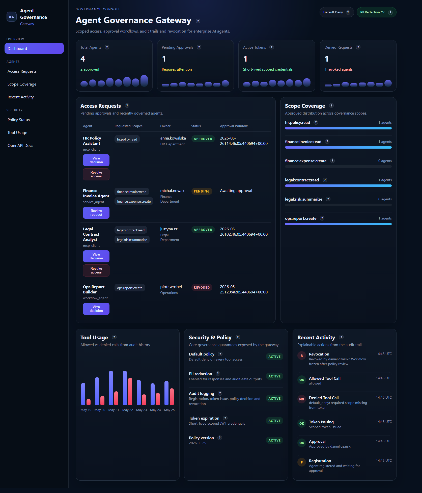
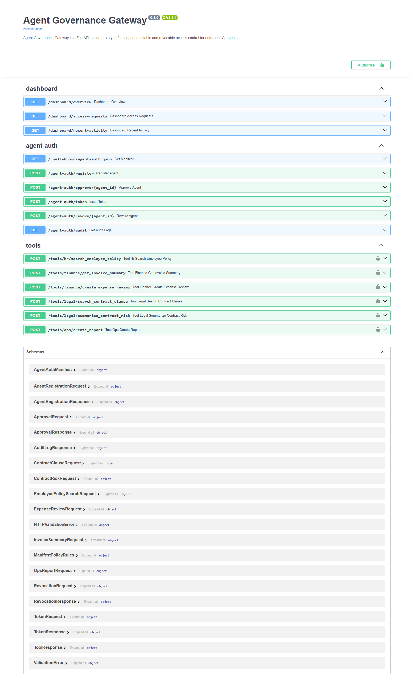

# Agent Governance Gateway

[](https://fastapi.tiangolo.com/)
[](https://www.python.org/)
[](#scoped-agent-access-instead-of-unrestricted-credentials)
[](#policy-enforced-tool-gateway)
[](https://github.com/danieloza/agent-governance-gateway/actions)
[](LICENSE)

Agent Governance Gateway is a FastAPI-based prototype for scoped, auditable and revocable access control for enterprise AI agents. Instead of giving agents unrestricted API keys, the gateway supports agent registration, human approval, short-lived scoped credentials, policy checks, PII redaction, tool-level access control and audit logs.

This project is positioned as a governance and access-control layer for internal AI automation across HR, Finance, Legal and Operations workflows. It is not a chatbot. It is the security boundary around agent execution.

## Product Thesis

Enterprise AI agents often need access to policies, invoices, contracts, reports and internal systems. The unsafe shortcut is to hand the agent raw API keys or direct database access.

That creates predictable failure modes:

- no least-privilege boundary
- no human approval checkpoint
- weak revocation
- poor auditability
- poor explainability for allow or deny decisions
- direct exposure to PII and sensitive business data

Agent Governance Gateway enforces a safer sequence:

1. the agent registers
2. the agent requests specific scopes
3. a human approves a subset of scopes
4. the gateway issues a short-lived scoped JWT
5. every tool call goes through policy enforcement
6. PII is redacted before responses leave the boundary
7. every important action is written to the audit trail

## What This Proves

This project demonstrates how to design a security boundary for AI agents operating inside business workflows:

- agents receive scoped, short-lived credentials instead of raw internal API keys
- human approval is modeled as part of the access lifecycle
- every tool call is checked against policy, tenant, scope, approval and revocation state
- sensitive mock business data is redacted before leaving the gateway
- audit logs explain what happened, who/what requested access, and why the request was allowed or denied
- the dashboard gives operators a review surface instead of hiding governance inside logs

## Screenshots

### Governance dashboard



### OpenAPI surface



## What makes it strong

### 1. Scoped agent access instead of unrestricted credentials

Agents do not access HR, finance or legal systems directly. They request narrow scopes such as:

- `hr:policy:read`
- `finance:invoice:read`
- `finance:expense:create`
- `legal:contract:read`
- `legal:risk:summarize`
- `ops:report:create`

### 2. Human approval as a first-class control

An agent can request scopes, but cannot self-authorize them. Approval is explicit and time-bounded.

### 3. Short-lived JWT credentials

Issued tokens are scoped, revocable in practice and designed to be re-checked at tool-call time.

### 4. Policy-enforced tool gateway

Every tool call goes through:

- token validation
- tenant boundary validation
- approval status checks
- revoked status checks
- tool-to-scope mapping
- scope presence validation
- audit logging
- PII redaction

### 5. Multi-tenant isolation for internal environments

The gateway now includes an MVP multi-tenant boundary:

- each agent belongs to a `tenant_id`
- audit logs store `tenant_id`
- issued JWTs include `tenant_id`
- tool calls require `X-Tenant-ID`
- the gateway denies requests when the request tenant and token tenant do not match

This is useful for shared internal platforms where multiple business units, subsidiaries or customers use the same control layer.

### 6. Auditability and explainability

The system records:

- registration
- approval
- token issuance
- revocation
- allowed tool calls
- denied tool calls
- invalid scope attempts
- policy failures

The dashboard includes:

- access request review
- policy decision drill-down
- revocation impact banner
- recent explainable activity

## Architecture

```text
AI Agent
  -> POST /agent-auth/register
  -> Human/Admin approves scopes
  -> POST /agent-auth/token
  -> POST /tools/...
       -> JWT validation
       -> Policy engine
       -> Tool-to-scope mapping
       -> Approval / revocation checks
       -> Mock tool execution
       -> PII redaction
       -> Audit log write
  <- Safe structured response
```

## Governance dashboard flow

The root route `/` serves an operator-facing governance console.

It highlights:

- total agents
- pending approvals
- active tokens
- denied requests
- scope coverage
- tool usage
- security and policy controls
- recent activity

The UI also includes:

- tooltip-based domain explanation
- an approval drawer for pending requests
- a policy decision drawer for recent audit events
- a revocation flow that visibly affects future access state

## Main endpoints

### Discovery and auth

- `GET /.well-known/agent-auth.json`
- `POST /agent-auth/register`
- `POST /agent-auth/approve/{agent_id}`
- `POST /agent-auth/token`
- `POST /agent-auth/revoke/{agent_id}`
- `GET /agent-auth/audit`

### Tool gateway

- `POST /tools/hr/search_employee_policy`
- `POST /tools/finance/get_invoice_summary`
- `POST /tools/finance/create_expense_review`
- `POST /tools/legal/search_contract_clause`
- `POST /tools/legal/summarize_contract_risk`
- `POST /tools/ops/create_report`

## Project structure

```text
agent-governance-gateway/
  app/
    __init__.py
    main.py
    database.py
    models.py
    schemas.py
    auth.py
    policies.py
    audit.py
    tools.py
    redaction.py
    config.py
    static/
      index.html
      dashboard.css
      dashboard.js
  tests/
    conftest.py
    test_agent_registration.py
    test_approval.py
    test_token.py
    test_tools_policy.py
    test_revocation.py
    test_redaction.py
  examples/
    sample_agent_client.py
  docs/
    ARCHITECTURE.md
    REDPANDA_POSITIONING.md
    assets/
      dashboard-overview.png
      openapi-docs.png
  README.md
  requirements.txt
  .env.example
  .gitignore
```

## Example flow

1. an agent registers with scopes such as `finance:invoice:read`
2. the agent is bound to a specific `tenant_id`
3. an admin approves only the scopes that should be allowed
4. the agent requests a short-lived JWT
5. the agent calls a tool through `/tools/...` with `X-Tenant-ID`
6. the gateway checks tenant match, policy, redacts PII and writes an audit log
7. an operator can revoke the agent at any time
8. future token issuance and future tool calls fail after revocation

## Run locally

```bash
python -m venv .venv
.venv\Scripts\activate
pip install -r requirements.txt
copy .env.example .env
uvicorn app.main:app --reload
```

Open:

- Dashboard: [http://127.0.0.1:8000/](http://127.0.0.1:8000/)
- OpenAPI docs: [http://127.0.0.1:8000/docs](http://127.0.0.1:8000/docs)

## Run tests

```bash
pytest -q
```

## curl examples

### 1. Register agent

```bash
curl -X POST http://127.0.0.1:8000/agent-auth/register ^
  -H "Content-Type: application/json" ^
  -d "{\"tenant_id\":\"finance-emea\",\"agent_name\":\"Finance Bot\",\"agent_type\":\"finance-agent\",\"requested_scopes\":[\"finance:invoice:read\",\"finance:expense:create\"],\"reason\":\"Invoice review workflow\",\"owner_user_id\":\"owner-001\"}"
```

### 2. Approve agent

```bash
curl -X POST http://127.0.0.1:8000/agent-auth/approve/1 ^
  -H "Content-Type: application/json" ^
  -d "{\"approved_scopes\":[\"finance:invoice:read\"],\"approved_by\":\"admin-001\",\"expires_in_hours\":8}"
```

### 3. Issue token

```bash
curl -X POST http://127.0.0.1:8000/agent-auth/token ^
  -H "Content-Type: application/json" ^
  -d "{\"agent_id\":1}"
```

### 4. Call allowed tool

```bash
curl -X POST http://127.0.0.1:8000/tools/finance/get_invoice_summary ^
  -H "Content-Type: application/json" ^
  -H "Authorization: Bearer YOUR_TOKEN" ^
  -H "X-Tenant-ID: finance-emea" ^
  -d "{\"invoice_id\":\"INV-2026-1001\"}"
```

### 5. Call denied tool

```bash
curl -X POST http://127.0.0.1:8000/tools/legal/search_contract_clause ^
  -H "Content-Type: application/json" ^
  -H "Authorization: Bearer YOUR_TOKEN" ^
  -H "X-Tenant-ID: finance-emea" ^
  -d "{\"contract_id\":\"CTR-9\",\"clause_query\":\"termination\"}"
```

### 6. Revoke agent

```bash
curl -X POST http://127.0.0.1:8000/agent-auth/revoke/1 ^
  -H "Content-Type: application/json" ^
  -d "{\"revoked_by\":\"admin-001\",\"reason\":\"Access no longer needed\"}"
```

### 7. Verify revoked token fails

```bash
curl -X POST http://127.0.0.1:8000/tools/finance/get_invoice_summary ^
  -H "Content-Type: application/json" ^
  -H "Authorization: Bearer YOUR_TOKEN" ^
  -H "X-Tenant-ID: finance-emea" ^
  -d "{\"invoice_id\":\"INV-2026-1001\"}"
```

Expected result: `403`, because the gateway re-checks revocation and policy state on every tool request.

## Enterprise AI governance mapping

This prototype maps directly to internal enterprise AI automation concerns:

- controlled access to internal systems
- human approval for sensitive agent capabilities
- audit logs for regulated workflows
- revocation when an agent is disabled, repurposed or fails policy review
- PII redaction before data leaves the access boundary
- explainable allow or deny decisions
- workflow safety for internal business automation

Example internal use cases:

- HR agent searching employee policy material
- Finance agent summarizing invoices
- Legal agent searching clauses or summarizing contract risk
- Operations agent creating reports

## Positioning

This is not a generic CRUD app and not a chatbot wrapper.

It is a portfolio-grade backend governance prototype for enterprise AI systems:

- Python 3.12
- FastAPI
- SQLAlchemy
- SQLite for MVP
- scoped JWT credentials
- policy enforcement
- auditability
- operator dashboard
- security-oriented workflow design

If you want the short version:

> Agent Governance Gateway is a FastAPI-based prototype for scoped, auditable and revocable access control for enterprise AI agents. Instead of giving agents unrestricted API keys, the gateway supports agent registration, human approval, short-lived scoped credentials, policy checks, PII redaction, tool-level access control and audit logs.
